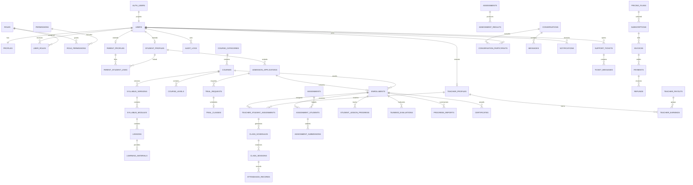

# Database entity relationship plan

## Domain map

## Phase 1 physical tables

- `users`: private application projection of `auth.users`, account status and lifecycle timestamps.
- `profiles`: display name, contact/locale/time-zone preferences, direction-independent identity data.
- `roles`, `permissions`, `role_permissions`, `user_roles`: configurable RBAC graph.
- `student_profiles`, `parent_profiles`, `teacher_profiles`, `parent_student_links`: minimal portal identity extensions and ownership links.
- `audit_logs`: immutable actor, action, target, request and before/after metadata.

## Phase 2 physical tables

- `branches`, `staff_profiles`, `branch_memberships`: branch registry, staff identity extension, and effective branch/role scope.
- `teacher_languages`, `teacher_availability`: normalized teaching-language and weekly local-time availability records.
- `teacher_applications`, `teacher_application_reviews`: stateful recruitment applications with immutable reviewer history.
- `teacher_documents`: private object metadata, quarantine/scan state, and reviewer decision state for the `teacher-private` bucket.
- `parent_student_links`: Phase 2 uses an RPC-only pending/active/rejected approval lifecycle with audit records.
- `profiles` and `teacher_profiles`: extended with onboarding completion and professional-verification fields.

## Future table groups

1. Academic catalogue: course categories through versioned lessons and materials.
2. Admissions and delivery: student applications, trials, enrollments, assignment history, schedules, sessions, attendance and rescheduling.
3. Learning: assignments, submissions, assessments, lesson progress, Tajweed, reports and certificates.
4. Finance: plans, subscriptions, invoices, payments, refunds, discounts, scholarships, earnings and payouts.
5. Communication and care: conversations, notifications, tickets, complaints and restricted safeguarding records.
6. Reference/content: countries, languages, currencies, pages, resources, FAQs, testimonials, email templates and system settings.

## Integrity rules

- Every relationship has an explicit foreign key and a supporting index on the referencing side.
- One-to-one extensions use `user_id` as both primary and foreign key.
- Versioned curriculum rows are immutable after use by an enrollment; a new syllabus version supersedes the prior version.
- Teacher assignment rows use effective date ranges to preserve reassignment history.
- Scheduling stores UTC instants and IANA time-zone identifiers separately.
- Financial amounts use exact `numeric` minor-unit-aware values and ISO currency references.
- Child safeguarding records are separated from general tickets so broad support permissions cannot reveal them.
