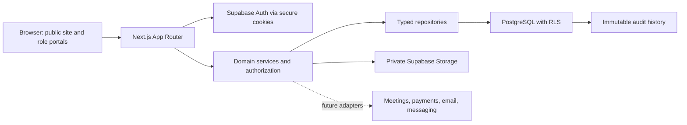

# Target technical architecture

## Architectural style

SHIA TALEEM starts as a modular monolith on Next.js App Router. React Server Components render by default. Client Components are limited to interactions that require browser state. Route Handlers and Server Actions expose the initial backend boundary, while domain services and repositories keep business rules independent from presentation code.

Supabase provides PostgreSQL, Auth, private Storage, and Row Level Security. Vercel is the initial application runtime. The architecture leaves explicit adapters for future Zoom, Google Meet, payment, email, WhatsApp, and monitoring providers.

## Runtime boundaries

## Security model

1. Supabase Auth establishes identity; the service-role key is never exposed to the browser.
2. Locale-aware portal layouts verify the user and require a portal permission.
3. Every Server Action and Route Handler validates input and re-checks authentication and authorization.
4. RLS protects every private table and uses indexed membership/permission lookups.
5. Authorization data lives in `roles`, `permissions`, `role_permissions`, and `user_roles`; it is not trusted from user-editable metadata.
6. Critical mutations call a security-definer audit function. Direct client writes to audit history are denied.
7. Admin-only mutations will require MFA assurance level 2 when the Security Center phase begins.

## Application modules

- `identity`: users, profiles, authentication, locale and time-zone preferences.
- `access-control`: roles, permissions, role assignments, authorization helpers.
- `audit`: append-only administrative and security events.
- `public-site`: managed marketing pages, courses, teachers, policies, resources.
- `students`, `parents`, `teachers`, `staff`: role portal capabilities.
- `academics`: course/curriculum, admissions, trials, enrollment, assignment, scheduling, attendance.
- `learning`: homework, assessment, Tajweed evaluation, progress, certificates.
- `finance`: pricing, invoices, payments, subscriptions, refunds, earnings and payouts.
- `communications`: conversations, notifications, support, complaints and safeguarding.
- `reporting`: dashboards, exports and operational analytics.

## Data and performance conventions

- UUID primary keys are used as required by the product brief; foreign keys and RLS predicate columns are indexed.
- Timestamps are `timestamptz`; schedule instants are stored in UTC.
- Flexible statuses use lookup tables once workflows become administrator-configurable. Stable foundation states use checked text values.
- Soft deletion is used where history must be preserved.
- Repository methods select only required columns and paginate collection queries.
- Independent server reads start together and are awaited with `Promise.all`.

## Internationalization

Routes are locale-prefixed (`/en`, `/ur`, `/ar`) and expose `dir` at the document boundary. English is the initial complete dictionary; Urdu and Arabic dictionaries share the same typed key contract. Persian can be added without changing routes or components. Dates, times, currencies, and time zones pass through locale-aware formatters.

## Deployment model

- Vercel: Next.js runtime and preview deployments.
- Supabase: Postgres, Auth, migrations and private academic/teacher document buckets.
- Cloudflare: optional DNS, WAF and edge rate limiting.
- Sentry: deferred until operational monitoring is configured.
- CI: lint, typecheck, unit tests and production build on pull requests.
